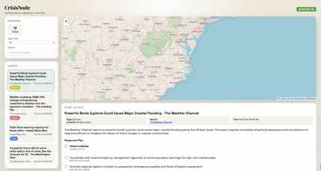
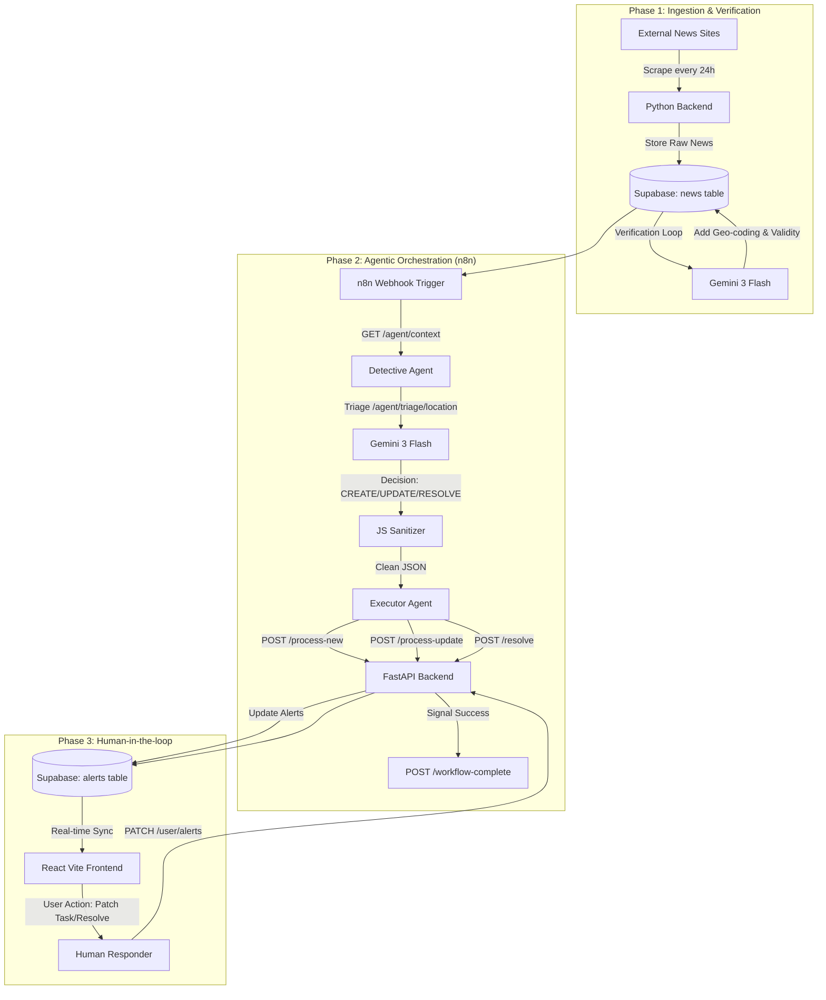

# Crisis Node: Multi-Agent Humanitarian Orchestration

[](https://www.ibm.com/)
[](https://abhisheksaraff.github.io/crisis-node/)
[](https://www.python.org/)
[](https://developer.mozilla.org/en-US/docs/Web/JavaScript)
[](https://developer.mozilla.org/en-US/docs/Web/CSS)
[](https://fastapi.tiangolo.com/)
[](https://n8n.io/)
[](https://react.dev/)
[](https://deepmind.google/technologies/gemini/)
[](https://supabase.com/)
[](https://www.docker.com/)

------------------------------------------------------------------------

## Overview

Developed for the **IBM Dev Day Hackathon 2026**, Crisis Node is a
high-fidelity disaster intelligence system.

It leverages **Generative AI** and **Large Language Models (LLMs)** to automate the lifecycle of humanitarian alerts --- moving from raw
web scraping → AI verification → multi-agent reasoning →
human-in-the-loop task execution using **Gemini 3 Flash**.



------------------------------------------------------------------------

## System Flow Diagram



------------------------------------------------------------------------
## Core Competencies & Implementation

### 1. Prompt Engineering & LLM Reliability

- Utilizes Gemini 3 Flash with sophisticated Role-Based Prompting (UN OCHA Persona).
- Chain-of-Thought (CoT): Agents are instructed to reason through the "Ground Truth" vs "Existing State" before executing database calls.
- Schema Enforcement: Strict JSON output guardrails ensure that non-deterministic Generative AI responses integrate seamlessly with the transactional backend.

### 2. Data Pipeline Optimization

- The system handles the "Latency-to-Action" gap through a multi-stage pipeline:
- Ingestion: Automated scraping and purging of stale news data.
- Enrichment: Automated geospatial tagging (Lat/Long) using LLMs to bypass manual entry errors.
- Batch Processing: Utilizes a "Split in Batches" orchestration pattern to handle concurrent global crises without hitting token limits.

### 3. Model Deployment & Infrastructure

- Containerized Microservices: Full Model Deployment and orchestration using Docker Compose.
- Decoupled Architecture: Separates the "Control Plane" (n8n) from the "Execution Plane" (FastAPI), ensuring heavy data processing does not block the UI.
------------------------------------------------------------------------

## The 3-Step Pipeline

### 1. Ingestion & Cleanup

-   24-hour scraping cycle
-   Removes stale news
-   Populates **Supabase `news` table**

### 2. AI Verification

-   Gemini 3 Flash Preview verifies authenticity
-   Extracts entities
-   Adds geospatial coordinates (lat/long)

### 3. Agentic Orchestration

-   n8n executes a **Detective → Executor** multi-agent pattern
-   Generates UN OCHA-style structured response plans
-   Populates **Supabase `alerts` table**

------------------------------------------------------------------------

## API Architecture

### User Endpoints (`/user`)

GET /alerts\
POST /alerts/{id}/actions/custom\
PATCH /alerts/{id}/actions/{index}\
POST /alerts/{id}/resolve

------------------------------------------------------------------------

### Agent Endpoints (`/agent`)

GET /context\
GET /triage/{location}\
POST /process-new\
POST /process-update\
POST /workflow-complete

------------------------------------------------------------------------

## Getting Started

### Clone the Repository

``` bash
git clone https://github.com/abhisheksaraff/crisis-node.git
cd crisis-node
```

### Environment Configuration

Create a `.env` file:

``` env
ENABLE_SCRAPER=True
ENABLE_DELETE=True
ENABLE_VERIFICATION=True
ENABLE_ORCHESTRATION_WORKFLOW=True
ENABLE_MARK_NEWS_READ=True

VITE_BASE_API_URL=http://backend:8000
FRONTEND_URL=http://localhost:5173
BACKEND_URL=http://backend:8000
ORCHESTRATION_URL_DOCKER=http://localhost:5678
ORCHESTRATION_URL_FASTAPI=http://orchestration:5678/webhook/orchestration

SUPABASE_URL=https://your-url.supabase.co
SUPABASE_SERVICE_KEY=your_key
SUPABASE_CONNECTION_STRING=postgresql://postgres...

GEMINI_API_KEY=your_key
```

### Deploy with Docker

``` bash
docker compose up -d --build
```

### Import n8n Workflow (Required)

```The Multi-Agent "Brain" must be manually imported into your n8n instance:

Open n8n at http://localhost:5678.

Click Workflows > Add Workflow > Import from File.

Select the file located at: orchestration/workflows/crisis-node.json.

Ensure your Google Gemini credentials are linked to the AI nodes in the canvas.

Click Execute Workflow to begin the first triage cycle.
```

------------------------------------------------------------------------

## Project Structure

    crisis-node/
    ├── .github/workflows/
    ├── frontend/
    ├── backend/
    └── orchestration/

------------------------------------------------------------------------

# Crisis Node

Transforming environmental noise into actionable humanitarian
intelligence.
